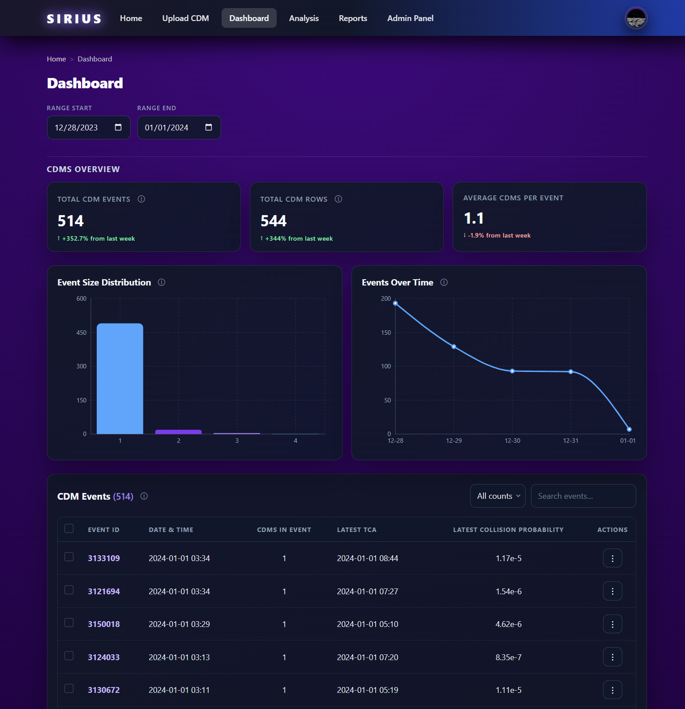
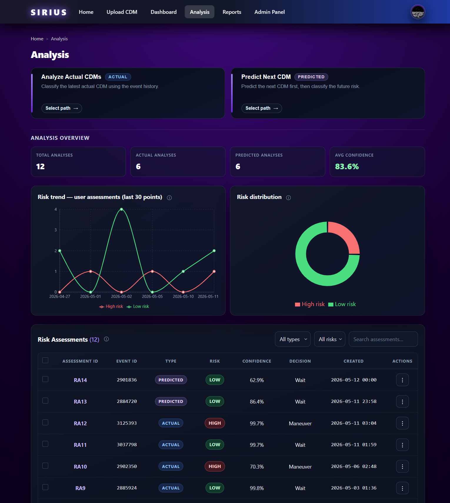
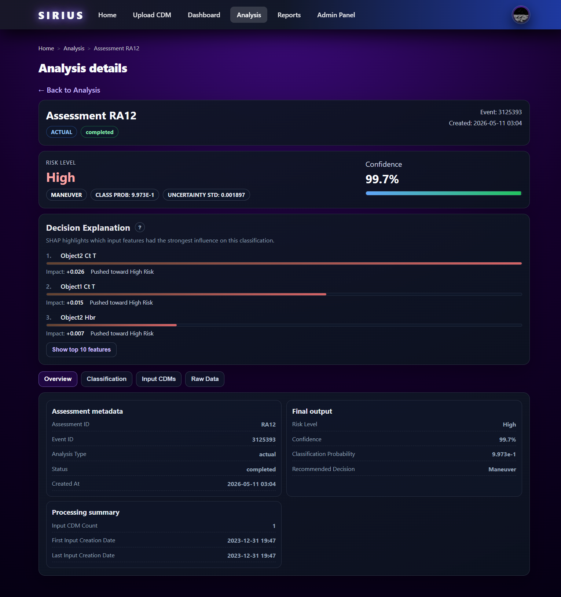
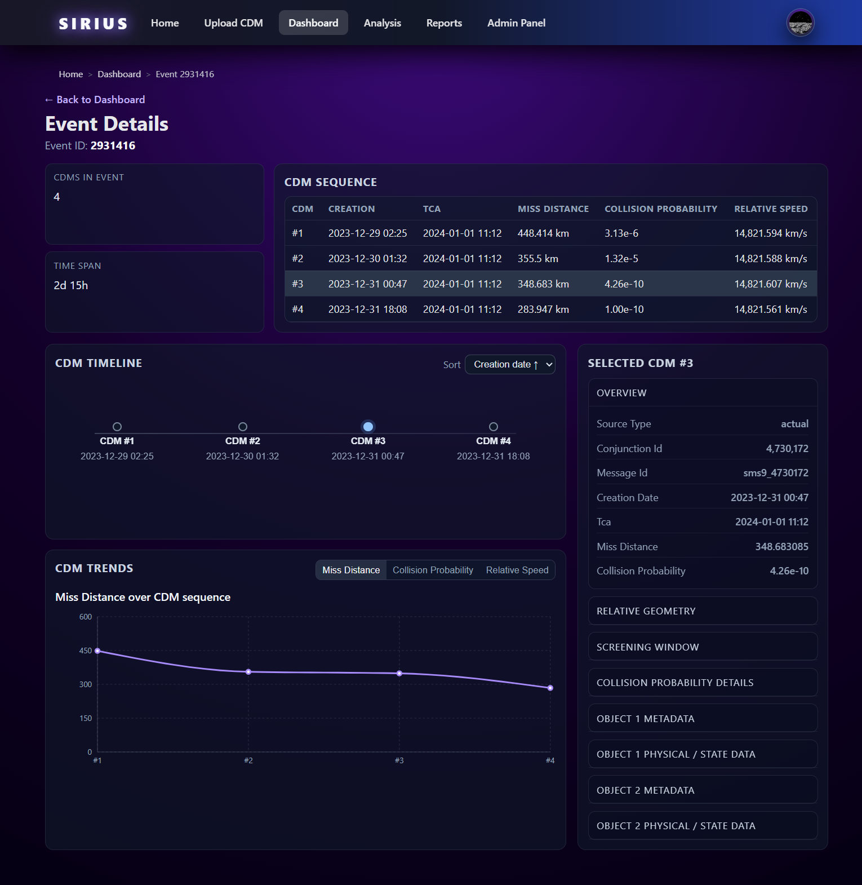
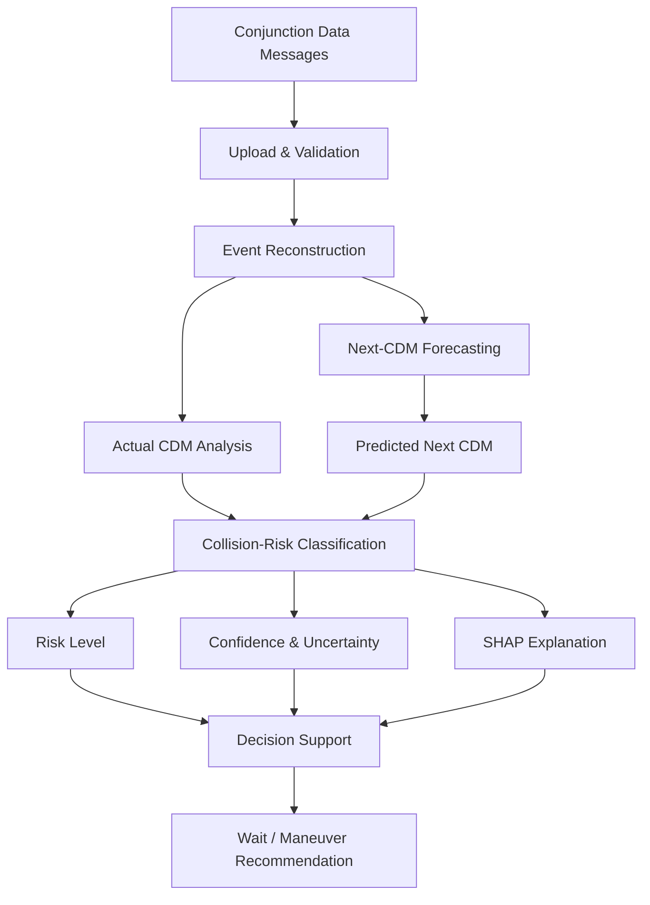
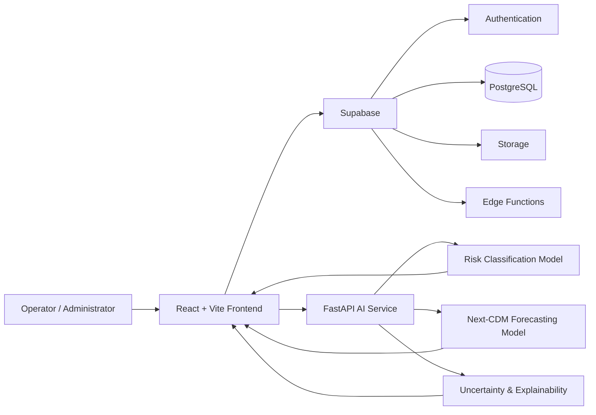

<div align="center">

# SIRIUS

### AI-Driven Decision Process Framework for Early Maneuver Planning in Satellite Collision Avoidance

**A full-stack, uncertainty-aware decision-support platform for satellite conjunction management.**

[Live Demo](https://sirius-ecru.vercel.app/)

**Computer Science Graduation Project — King Abdulaziz University**

</div>

---

## Overview

Satellite conjunction events evolve over time through a sequence of **Conjunction Data Messages (CDMs)**. Operators must continuously assess these updates to determine whether a close approach can be safely monitored or may require a collision-avoidance maneuver.

**SIRIUS** is an AI-driven decision-support framework designed to support this process. It combines CDM data management, Transformer-based machine learning, uncertainty estimation, explainable AI, and a full-stack web application in one system.

SIRIUS enables operators to:

- upload and validate CDM data,
- reconstruct and inspect conjunction events,
- classify collision risk from observed CDM sequences,
- predict the next CDM before it becomes available,
- quantify model confidence and predictive uncertainty,
- explain model decisions using feature attribution,
- recommend **Wait** or **Maneuver**,
- visualize event evolution and analysis results,
- and generate downloadable reports.

> **Demo note:** The deployed application is available for demonstration. Some features require an authorized Operator or Administrator account.

---

## Screenshots

### Dashboard

Overview of conjunction events, CDM statistics, event-size distribution, temporal trends, and event navigation.



### Analysis Workspace

SIRIUS supports both **Actual CDM Analysis** and **Predicted Next-CDM Analysis**, with assessment history, confidence information, risk distributions, and decision recommendations.



### Risk Assessment & Explainability

Each assessment presents the predicted risk level, model confidence, uncertainty, recommended action, and SHAP-based feature contributions.



### Event Details

Operators can inspect the CDM sequence of an event, view its timeline, examine individual messages, and track how key conjunction parameters evolve.



---

## Key Features

### CDM Upload & Validation
Upload conjunction data and track processing status, valid and invalid records, and validation feedback.

### Collision-Risk Classification
A Transformer-based classifier analyzes the available CDM history and assigns a collision-risk level.

### Next-CDM Forecasting
A forecasting model predicts the next CDM from the observed event sequence, enabling earlier risk assessment before the next real message arrives.

### Uncertainty-Aware Inference
Monte Carlo Dropout is used during inference to estimate uncertainty and provide confidence information alongside model outputs.

### Decision Support
Model outputs are translated into a clear recommendation:

- **Wait** — continue monitoring the conjunction.
- **Maneuver** — collision-avoidance intervention should be considered.

### Explainable AI
SHAP-based explanations show which input features contributed most strongly to a classification result.

### Event Monitoring & Visualization
Interactive dashboards, event timelines, trend charts, and CDM-level details help operators inspect how conjunction conditions change over time.

### Reports
Generate downloadable risk-assessment and event-summary reports.

### Role-Based Access Control
Separate **Operator** and **Administrator** capabilities support controlled access and operator-account management.

---

## How SIRIUS Works



---

## AI & Research Highlights

SIRIUS uses sequential deep-learning models to capture how conjunction parameters evolve across CDM histories rather than treating each message as an isolated observation.

### Risk Classification

The collision-risk component uses a **Transformer Encoder** for sequence classification.

| Metric | Result |
|---|---:|
| Accuracy | **93.28%** |
| F2 Score | **0.9401** |

The inference pipeline also applies **Monte Carlo Dropout** to quantify predictive uncertainty.

### Next-CDM Prediction

A second Transformer-based model forecasts the next CDM in the sequence. The predicted message can then be passed into the collision-risk pipeline to support **early predictive analysis**.

### Explainability

SIRIUS integrates **SHAP** feature attribution to explain model decisions. During model analysis, influential factors included features related to hard-body radius, relative velocity, and miss distance.

---

## Technology Stack

| Layer | Technologies |
|---|---|
| Frontend | React, Vite, React Router |
| Backend & Database | Supabase, PostgreSQL |
| Authentication | Supabase Auth |
| Backend Functions | Supabase Edge Functions |
| AI Service | Python, FastAPI |
| Machine Learning | PyTorch, Scikit-learn |
| Explainable AI | SHAP |
| Data Processing | Pandas, NumPy |
| Visualization | Recharts |
| Reports | jsPDF |
| Deployment | Vercel |

---

## System Architecture



The web client communicates with **Supabase** for authentication, persistence, CDM processing, and application data. Machine-learning inference is handled by a separate **FastAPI** service containing the trained classification and forecasting components.

---

## Application Modules

| Module | Purpose |
|---|---|
| **Home** | Introduces the platform and its decision-support workflow. |
| **Upload CDM** | Uploads, validates, and processes CDM datasets. |
| **Dashboard** | Summarizes conjunction events and provides event-level exploration. |
| **Event Details** | Shows CDM history, timelines, trends, and message-level information. |
| **Analysis** | Runs actual or predicted collision-risk assessments. |
| **Analysis Details** | Displays risk, confidence, uncertainty, explanation, and recommendation. |
| **Reports** | Generates downloadable summaries. |
| **Admin Panel** | Manages authorized operator accounts and access. |

---

## Repository Structure

```text
sirius/
├── ai-service/
│   ├── classification_artifacts/
│   ├── forecasting_artifacts/
│   ├── classification_runtime.py
│   ├── prediction_runtime.py
│   ├── main.py
│   └── requirements.txt
│
├── sirius-frontend/
│   ├── cdm-worker/
│   ├── docs/
│   ├── public/
│   ├── src/
│   ├── supabase/
│   ├── worker/
│   ├── .env.example
│   └── README.md
│
└── README.md
```

The repository contains the web application, Supabase-related backend functionality, CDM processing components, and the Python AI inference service.

For frontend development and local setup details, see [`sirius-frontend/README.md`](sirius-frontend/README.md).

---

## Academic Context

SIRIUS was developed as a **Computer Science graduation project at King Abdulaziz University**.

The project investigates how artificial intelligence can support satellite conjunction management through:

- sequential modeling of CDM histories,
- early collision-risk assessment,
- next-CDM forecasting,
- uncertainty-aware prediction,
- explainable AI,
- and operator-oriented decision support.

The system is intended as a research prototype exploring how AI can assist human operators with earlier and more informed conjunction-management decisions.

---

## Team

**Department of Computer Science — King Abdulaziz University**

**Project Members**
- [Amirah Manyur Almutairi](https://github.com/avmera)
- [Jana Ali Redaini](https://github.com/somaa333)
- [Rana AbdlaZiz Alzahrani](https://github.com/ranaAziz9)

**Supervisor**
- Mai Fadel

---

## Disclaimer

SIRIUS is an **academic research prototype** developed for educational and research purposes. It is not an operational flight-safety system and should not be used as the sole basis for real-world spacecraft maneuver decisions.

---

## License

No open-source license is currently granted for this repository. Please contact the project authors regarding reuse, modification, or redistribution of the source code.

---

<div align="center">


</div>
